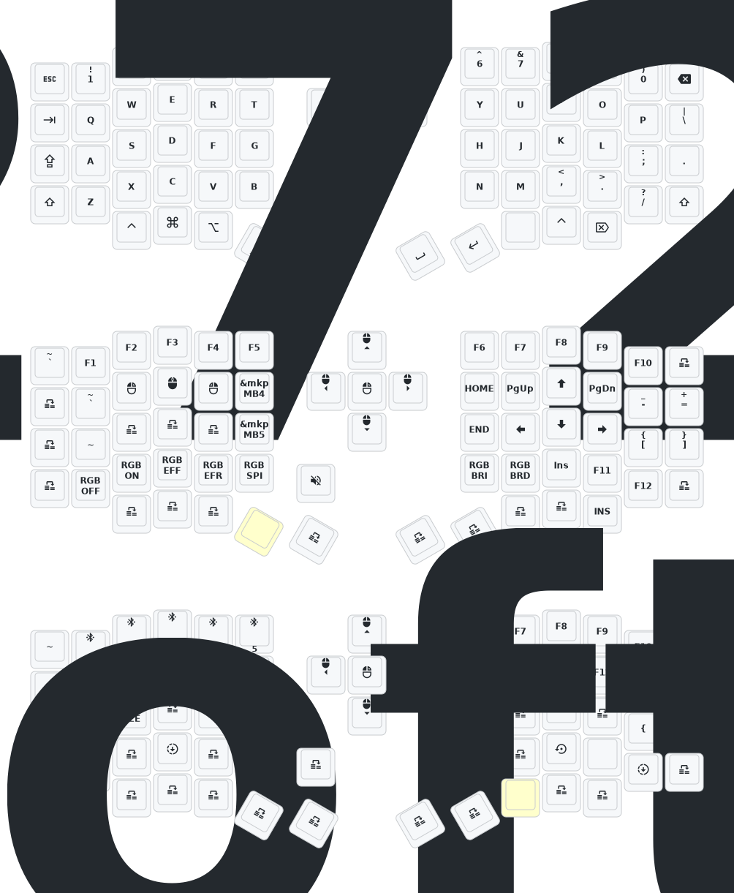

This is fork of https://github.com/a741725193/zmk-sofle/tree/main, but somhow I've lost commits history.

I use this configuration for PandaKB Sofle keyboard clone [from Aliexpress](https://aliexpress.ru/item/1005007821701661.html?spm=a2g2w.orderdetail.0.0.4b904aa6UD2WYs&sku_id=12000042329496456) 

This use [my animation](https://github.com/mvbasov/nice-view-sun) 

The original README:
---
2024年10月24日更新内容：修改供电模式，功耗降低。修正RGB供电自动关闭的功能。如果您的键盘于10月24日之前更新，请更新最新的固件。
Update on October 24, 2024: Modified power supply mode to reduce power consumption. Corrected the function of automatic shutdown of RGB power supply. If your keyboard is updated before October 24th, please update the latest firmware.

如需3D打印的模型文件或者键盘有任何异常和故障，请联系380465425@qq.com
If you need the 3D printed model file or if there are any abnormalities with the keyboard, please contact 380465425@qq.com
# zmk-config-sofle

